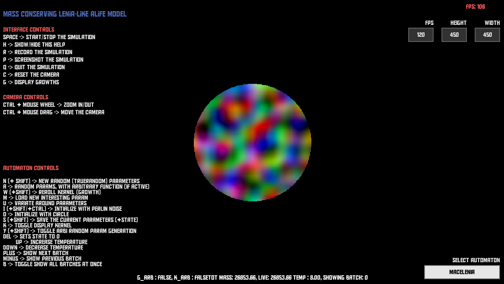

# MaCE
This repo hosts the code used in the paper 'MaCE : General Mass Conserving Dynamics for CAs'.

## Installation
Running this repo requires Python 3.12+ (Python 3.10 should work, but untested). Having an nvidia GPU is recommended, but dynamics can still be run at reasonable speeds on CPU on lower world sizes ($<300x300$).

(If you are on Windows and want to use GPU, before proceeding please follow the Pytorch [installation instructions](https://pytorch.org/get-started/locally/), to install Pytorch with GPU support.)

To install all dependencies, run 
`pip install requirements.txt`

To test that everything is working, run : 
`python simulate -d cpu -w 200 200`. 
If everything went as planned, a pygame window should open, with a perlin noise ball in the middle.

## Running the different models
The repo comes with an interactive window where you can run and interact with different models, in particular MaCELenia and slight modifications of it.

The main entry point for the interactive simulation is the script `simulate.py`. The options are as follows : 

```
usage: simulate.py [-h] [-s SCREEN SCREEN] [-w WORLD WORLD] [-d DEVICE]

Run cellular automata simulation

options:
  -h, --help            show this help message and exit
  -s SCREEN SCREEN, --screen SCREEN SCREEN
                        Screen dimensions as width height (default: 1280 720)
  -w WORLD WORLD, --world WORLD WORLD
                        World dimensions as width height (default: 250 250)
  -d DEVICE, --device DEVICE
                        Device to run on: "cuda" or "cpu" (default: cpu)
```

The most important parameter is `DEVICE`, and should be set to `cuda` if you have an nvidia GPU. Other devices (such as 'mps') can work, but are untested.

Screen size can be resized a posterior simply by resizing the window. Note that due to the pygame bottleneck, a huge screen size will tend to lower FPS significantly (HD screen size can't go above ~60 FPS using pygame).

The world size is the actual size of the simulated world. This can be modified using the simulation UI while running the program as well.

### Simulation window
All information and interactivity is displayed in the simulation GUI. The window you will see will look as follows.



On the top left, general interface controls are displayed. These controls are applicable no matter which model is currently selected. Just below, camera controls are displayed. The windows can be resized at will.

On the bottom left, there are Automaton-specific controls. These are controls that can be used to interact with the currently selected model. Try them out to see exactly what they do!

In the middle, the main simulation window is displayed. You can always reset the view by pressing 'C'. There is an info string displayed at the bottom, which displays some important values pertaining to the current state of the model.

On the top right, current FPS as well as target FPS is displayed. Remember that current FPS can have two bottlenecks : 
- the computation of the simulation dynamics, which can be eased by reducing the world size
- the rendering and display of the pygame window. This can be eased by resizing the screen.
You can also resize the world size by changing the Height and Width values.

Finally, on the bottom right there is a dropdown menu to select the different available models. Here is a list : 
- MaCELenia : Basic model that is a combination of Lenia with the MaCE rule.
- MaCELeniaCrossChannel : Same as MaCELenia, but including the cross-channel interaction update.
- Lenia : Standard Lenia automaton, on which MaCELenia is based
- FlowLenia : Re-implementation of FlowLenia in Pytorch
- AsymptoticMaCELenia : Implementation of MaCELenia including the $\Delta x$ and $\Delta t$ parameters, which allows exploring the continuous limit by varying the discretization.
- EvolvableMaCELenia :(EXPERIMENTAL) Implementation that allows extrinsic evolution experiments, and manual evolution. Not as well documented, and still experimental (might be buggy)

*To skim nice dynamics, we recommend cycling throught the saved parameters with `M` on `MaCELenia` and `MaCELeniaCrossChannel`, and potentially trying random parameters using `N` and `A`.*
## Code structure
This repository builds on top of [PyCA](https://github.com/frotaur/PyCA), for more information one can follow the tutorial linked in PyCA's README. Here, we briefly go over the code structure, and chiefly where the MaCE rule is implemented. Main files that could be of interest are marked with 🔴. All files marked with the sign have been extensively documented, and we have made effort so the code is as readable and understandable as possible.

```
DiffusionLenia/
├── requirements.txt           # Dependencies required to run the project
├── 🔴 simulate.py                # Entry point for running simulations
├── main.py                    # Script called by simulate.py. Contains all the pygame window logic
├── 🔴 intrinsicruns.py           # Script to run intrisic evolution experiments
├── modules/                   # All automata and utilities in here
│   ├── models/                # Base automaton classes and interfaces
│   │   ├── 🔴 MaCELenia.py          # Implementation of the MaCELenia model
│   │   ├── 🔴 MaCELeniaCrossChannel.py # Cross-channel extension of MaCELenia
│   │   ├── AsymptoticMaCELenia.py   # MaCELenia with discretization parameters
│   │   ├── EvolvableMaCELenia.py    # Experimental evolution framework
│   │   ├── 🔴 Lenia.py              # Standard Lenia implementation
│   │   ├── FlowLenia.py             # FlowLenia implementation
│   │   └── utils/                   # Utilities used by models, such as the LeniaParam class, and random fourier function generation 
│   │        ├── 🔴 leniaparams.py      # All utility for generating random lenia parameters is here. Extensively documented, but dense.
│   │        ├── 🔴 funcgen.py          # Utility for generating functions sampled with random fourier coefficients. Document, but dense.
│   │        └── others                 # Other mixed utility, not particularly interesting
│   └── main_utils/            # General utility functions for dealing with the pygame window
├── demo*/                     # Folders containing saved model parameters
├── saved*/                    # Folders that may be created when saving parameters with 'S' in the simulation
├── videos/                    # Videos recorded in the simulation are saved here
├── images/                    # Screenshots taken in the simulation are saved here
```

The most interesting parts, pertaining to the paper, are located in `MaCELenia.py`, and specifically, the method `MaCELenia.step()`. It is deeply commented, and can serve as a reference implementation for the MaCE update.
It is implemented with pytorch, and we parallelized the update as much as possible. It requires several passes, but it can (at the cost of some redundant computations) be rewritten as a `5\times 5` one pass CA update.

The `step()` method of `MaCELeniaCrossChannel` can also be inspected for the implementation of the cross-channel update.

`Lenia.py` simply contains our re-implementation of Lenia. The code is quite involved, as it allows for running many worlds with different parameters in parallel, and is written with extensive interactivity.

Finally, the script `intrinsicruns.py` can be easily modified and used to run intrinsic evolution experiments, provided one has a GPU available.

